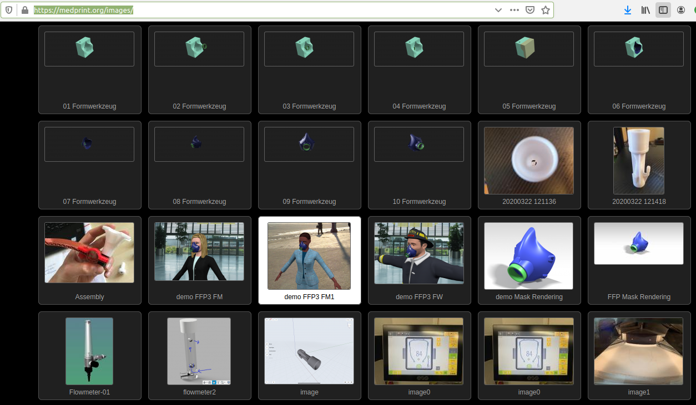

# Initial page

### fightcorona

collection of ideas to fight corona

* Take part on the Virushackthon
  * [https://wirvsvirushackathon.org/](https://wirvsvirushackathon.org/)

### 

### Wirvscorona

#### Medprint

* [https://devpost.com/software/medprint-3d-druck-fur-medizinische-anwendungen](https://devpost.com/software/medprint-3d-druck-fur-medizinische-anwendungen)
  * [https://medprint.org/images/](https://medprint.org/images/)
  * [https://www.medprint.org/presentation/](https://www.medprint.org/presentation/)

### Cadus.org

* Remo2hbo -Robustes und reparierbares Vitalparametermonitoring
  * [https://media.ccc.de/v/35c3-9765-remo2hbo\_-robustes\_und\_reparierbares\_vitalparametermonitoring](https://media.ccc.de/v/35c3-9765-remo2hbo_-robustes_und_reparierbares_vitalparametermonitoring)
  * [https://github.com/cadus/remo2hbo-wiki/wiki](https://github.com/cadus/remo2hbo-wiki/wiki)
  * [https://github.com/cadus/remo2hbo-wiki](https://github.com/cadus/remo2hbo-wiki)
  * [http://remo2hbo.f4.htw-berlin.de/](http://remo2hbo.f4.htw-berlin.de/)
  * [https://github.com/cadus](https://github.com/cadus)
* DG85: Crisis Response Makerspace in Berlin
  * [https://media.ccc.de/v/dg-85](https://media.ccc.de/v/dg-85)
* [https://19.re-publica.com/en/session/vitalparameter-monitoring-selbstgebaut-vom-sensor-bis-zur-anzeige-auf-dem-smartphone](https://19.re-publica.com/en/session/vitalparameter-monitoring-selbstgebaut-vom-sensor-bis-zur-anzeige-auf-dem-smartphone)
* [https://maker-faire.de/maker/remo%c2%b2hbo-robustes-und-reparierbares-vitalparametermonitoring-im-mobilen-krankenhaus/](https://maker-faire.de/maker/remo%c2%b2hbo-robustes-und-reparierbares-vitalparametermonitoring-im-mobilen-krankenhaus/)

### 

### 







