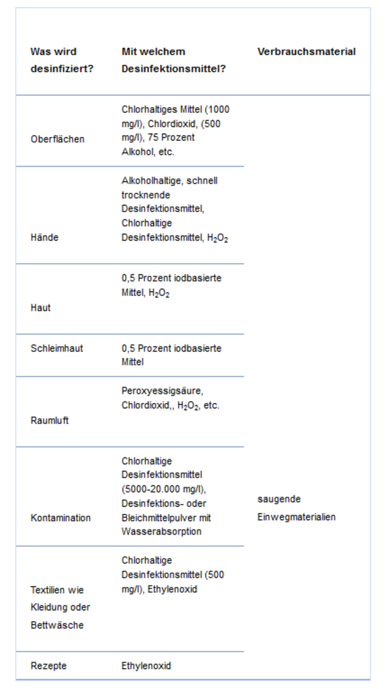

# Desinfektion

## Desinfection \(ideas to desinfect areas and tools\)

_\*_ all these ideas has to be checked, it is just an collection and needs to be doublechecked

### some studies

* Survival of influenza virus on banknotes.
  * [https://www.ncbi.nlm.nih.gov/pubmed/18359825?dopt=Abstract](https://www.ncbi.nlm.nih.gov/pubmed/18359825?dopt=Abstract)
  * [https://www.ncbi.nlm.nih.gov/pmc/articles/PMC2394922/](https://www.ncbi.nlm.nih.gov/pmc/articles/PMC2394922/)
* Survival of influenza viruses on environmental surfaces.
  * [https://www.ncbi.nlm.nih.gov/pubmed/6282993?dopt=Abstract](https://www.ncbi.nlm.nih.gov/pubmed/6282993?dopt=Abstract)
  * [https://academic.oup.com/jid/article-abstract/146/1/47/992812?redirectedFrom=fulltext](https://academic.oup.com/jid/article-abstract/146/1/47/992812?redirectedFrom=fulltext)
* Survival of influenza virus on human fingers.
  * [https://www.ncbi.nlm.nih.gov/pubmed/23927722](https://www.ncbi.nlm.nih.gov/pubmed/23927722)
  * [https://www.clinicalmicrobiologyandinfection.com/article/S1198-743X\(14\)60219-6/fulltext](https://www.clinicalmicrobiologyandinfection.com/article/S1198-743X%2814%2960219-6/fulltext)
* Aerosol and surface stability of HCoV-19 \(SARS-CoV-2\) compared to SARS-CoV-1
  * [https://www.medrxiv.org/content/10.1101/2020.03.09.20033217v2](https://www.medrxiv.org/content/10.1101/2020.03.09.20033217v2)

### heat

* for influenza \([https://de.wikipedia.org/wiki/Influenza\#%C3%9Cbertragung](https://de.wikipedia.org/wiki/Influenza#%C3%9Cbertragung)\)
  * Temp &gt;60°C &lt;30 min
  * Temp &gt;70°C &lt; wenige Sekunden

### ozone

* [https://www.thailandmedical.news/news/ozone-can-be-used-to-destroy-the-new-coronavirus-and-disinfect-areas](https://www.thailandmedical.news/news/ozone-can-be-used-to-destroy-the-new-coronavirus-and-disinfect-areas)

### uv-light

!checken

* Effects of Ultraviolet Germicidal Irradiation \(UVGI\) on N95 Respirator Filtration Performance and Structural Integrity
  * [https://www.ncbi.nlm.nih.gov/pmc/articles/PMC4699414/?fbclid=IwAR3ClQTdVdYXx4kdJGHZnSCvaFln3tGonmvu3USXdAZnIRCeE8qv0nHzK6A](https://www.ncbi.nlm.nih.gov/pmc/articles/PMC4699414/?fbclid=IwAR3ClQTdVdYXx4kdJGHZnSCvaFln3tGonmvu3USXdAZnIRCeE8qv0nHzK6A)
  * [nihms747549.pdf](:/5be4adc9a7d14ba49553945439750d31)
* [https://www.ingenieur.de/technik/fachbereiche/ittk/autonomer-roboter-eliminiert-krankenhauskeime-mit-uv-c-licht/](https://www.ingenieur.de/technik/fachbereiche/ittk/autonomer-roboter-eliminiert-krankenhauskeime-mit-uv-c-licht/)

### chemical stuff

* [https://www.ptaheute.de/news/artikel/welche-desinfektionsmittel-sind-bei-coronaviren-geeignet/](https://www.ptaheute.de/news/artikel/welche-desinfektionsmittel-sind-bei-coronaviren-geeignet/)

* [https://pflegemittelbox.de/desinfektionsmittel-coronavirus-grippe/](https://pflegemittelbox.de/desinfektionsmittel-coronavirus-grippe/)

* [https://utopia.de/ratgeber/coronavirus-achtung-diese-hand-desinfektionsmittel-helfen-nicht/](https://utopia.de/ratgeber/coronavirus-achtung-diese-hand-desinfektionsmittel-helfen-nicht/)

### **who Rezept**

* [https://www.who.int/emergencies/diseases/novel-coronavirus-2019/advice-for-public](https://www.who.int/emergencies/diseases/novel-coronavirus-2019/advice-for-public)
* WHO Receipt [https://www.who.int/gpsc/5may/Guide\_to\_Local\_Production.pdf](https://www.who.int/gpsc/5may/Guide_to_Local_Production.pdf)

### biologisch

* [https://www.pflanzliche-antibiotika.de/](https://www.pflanzliche-antibiotika.de/)

### **Senföle**

* [https://de.wikipedia.org/wiki/Senf%C3%B6lglycoside\#cite\_note-Schilcher2016-4](https://de.wikipedia.org/wiki/Senf%C3%B6lglycoside#cite_note-Schilcher2016-4)
* Untersuchungen über den Einfluß von Senfölen auf die Vermehrung des Influenza-Virus im exembryonierten Hühnerei
  * [https://link.springer.com/article/10.1007/BF00409992](https://link.springer.com/article/10.1007/BF00409992)
* [https://www.naturheilpraxis-ernestus.de/infothek/gesundheit/pflanzliches-gegen-viren/](https://www.naturheilpraxis-ernestus.de/infothek/gesundheit/pflanzliches-gegen-viren/)
* [https://www.biologie-seite.de/Biologie/Senf%C3%B6lglycoside](https://www.biologie-seite.de/Biologie/Senf%C3%B6lglycoside)
* [https://www.gesundheit-adhoc.de/senfoelmischung-wirksam-gegen-influenzavirus.html](https://www.gesundheit-adhoc.de/senfoelmischung-wirksam-gegen-influenzavirus.html)
* [https://www.apotheke-adhoc.de/branchennews/alle-branchennews/branchennews-detail/pflanzliche-therapie-von-harn-und-atemwegsinfekten-klinisch-gepruefte-produkte-bevorzugen/](https://www.apotheke-adhoc.de/branchennews/alle-branchennews/branchennews-detail/pflanzliche-therapie-von-harn-und-atemwegsinfekten-klinisch-gepruefte-produkte-bevorzugen/)

### elektrochemisch

* [https://www.ingenieur.de/technik/fachbereiche/energie/neues-desinfektionsmittel-laesst-mikroorganismen-implodieren/](https://www.ingenieur.de/technik/fachbereiche/energie/neues-desinfektionsmittel-laesst-mikroorganismen-implodieren/)
* [https://www.treox.de/](https://www.treox.de/)

### 

