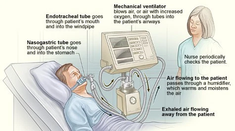
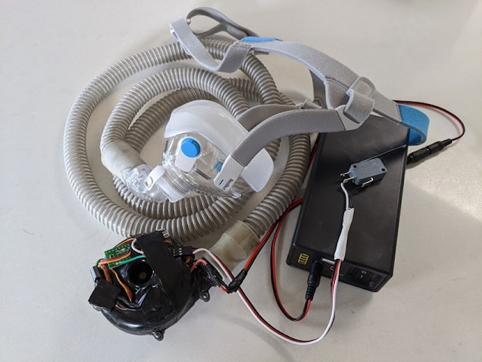
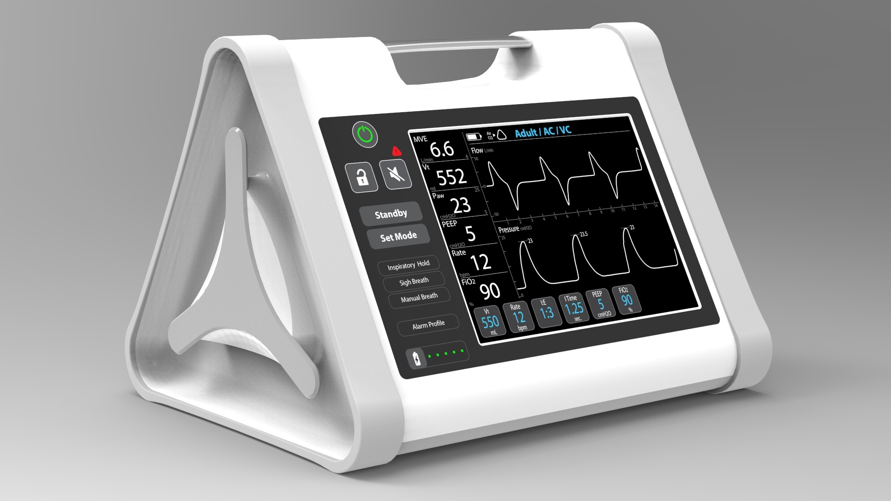
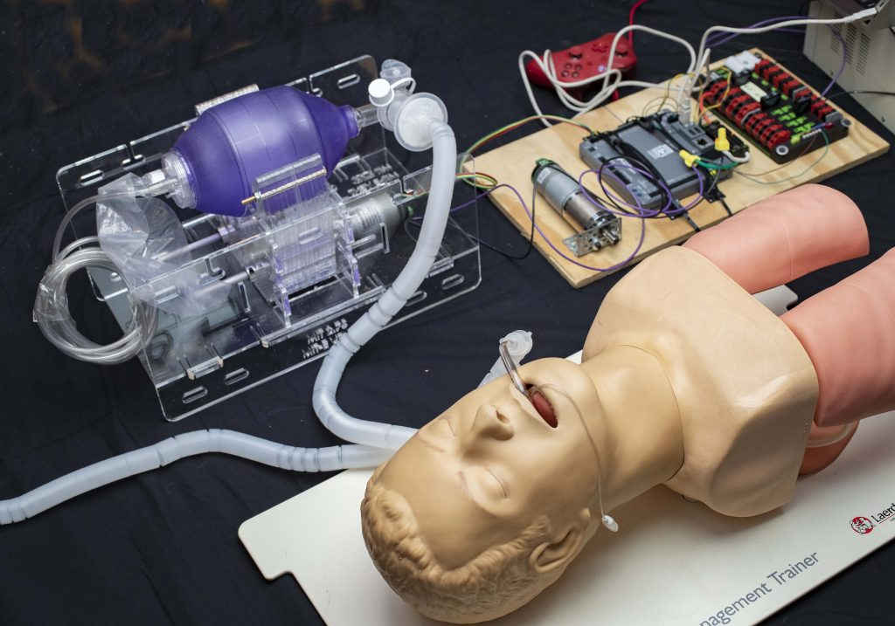

# Beatmungsgeräte

## Beatmungsgeräte

### Open Source Beatmungsgerät

* Montreal hospitals launch ventilator prize
  * [https://www.youtube.com/watch?v=eVc3BW2Lyn4&feature=youtu.be](https://www.youtube.com/watch?v=eVc3BW2Lyn4&feature=youtu.be)
  * [https://wirvsvirus.slack.com/archives/C010G62MNAG/p1584791047030400](https://wirvsvirus.slack.com/archives/C010G62MNAG/p1584791047030400)
  * [https://www.mghfoundation.com/en/](https://www.mghfoundation.com/en/)
  * [https://www.mghfoundation.com/en/news/code-life-ventilator-challenge/](https://www.mghfoundation.com/en/news/code-life-ventilator-challenge/)
  * [https://www.innovationtoronto.com/2020/03/montreal-hospitals-launch-global-challenge-to-design-low-cost-ventilators/](https://www.innovationtoronto.com/2020/03/montreal-hospitals-launch-global-challenge-to-design-low-cost-ventilators/)
  * [https://www.3dnatives.com/de/code-life-ventilator-challenge-200320201/](https://www.3dnatives.com/de/code-life-ventilator-challenge-200320201/)
  * [https://www.heise.de/newsticker/meldung/Neue-Beatmungsgeraete-gesucht-Belohnung-winkt-wenn-s-flott-geht-4687601.html](https://www.heise.de/newsticker/meldung/Neue-Beatmungsgeraete-gesucht-Belohnung-winkt-wenn-s-flott-geht-4687601.html)
  * [https://hackaday.com/2020/03/12/ultimate-medical-hackathon-how-fast-can-we-design-and-deploy-an-open-source-ventilator/](https://hackaday.com/2020/03/12/ultimate-medical-hackathon-how-fast-can-we-design-and-deploy-an-open-source-ventilator/)

### Arduino Beatmungsgerät

* [https://blog.arduino.cc/2020/03/17/designing-a-low-cost-open-source-ventilator-with-arduino/](https://blog.arduino.cc/2020/03/17/designing-a-low-cost-open-source-ventilator-with-arduino/)
* [https://github.com/jcl5m1/ventilator](https://github.com/jcl5m1/ventilator)

### Hackaday Prize Semifinalist: Individualized Breathing Apparatus

* [https://hackaday.com/2015/09/25/hackaday-prize-semifinalist-individualized-breathing-apparatus/](https://hackaday.com/2015/09/25/hackaday-prize-semifinalist-individualized-breathing-apparatus/)

### Opensource Beatmungsgerät

* [https://devpost.com/software/diy-beatmungsgerat](https://devpost.com/software/diy-beatmungsgerat)
* [https://twitter.com/miskaknapek/status/1241791968419741697](https://twitter.com/miskaknapek/status/1241791968419741697)

[https://pbs.twimg.com/media/ETu7GVCXsAIU-dF?format=jpg&name=large](https://pbs.twimg.com/media/ETu7GVCXsAIU-dF?format=jpg&name=large)

* [https://www.youtube.com/watch?v=DzOd6LIBdXI&feature=youtu.be](https://www.youtube.com/watch?v=DzOd6LIBdXI&feature=youtu.be)

### Opensource Beatmungsgerät MIT

* [https://www.technologyreview.com/s/615380/we-need-more-ventilators-heres-what-it-will-take-to-get-them/](https://www.technologyreview.com/s/615380/we-need-more-ventilators-heres-what-it-will-take-to-get-them/)

### e-vent MIT

* [https://e-vent.mit.edu/](https://e-vent.mit.edu/)

### A Single Ventilator for Multiple Simulated Patients to Meet Disaster Surge

* [https://onlinelibrary.wiley.com/doi/epdf/10.1197/j.aem.2006.05.009](https://onlinelibrary.wiley.com/doi/epdf/10.1197/j.aem.2006.05.009)
* COVID-19 How to Use One Ventilator to Save Multiple Lives
  * [https://www.youtube.com/watch?v=uClq978oohY&feature=youtu.be](https://www.youtube.com/watch?v=uClq978oohY&feature=youtu.be)

### [CORESPONSE - COvid19 RESPirator OpeN SourcE](https://coresponse.github.io/blog/)

* Overview of Designs 
  * [https://coresponse.github.io/blog/concept/2020/03/24/Overview\_of-Designs.html](https://coresponse.github.io/blog/concept/2020/03/24/Overview_of-Designs.html)

### Freebreathing.org

* [https://freebreathing.org/public-authorities/](https://freebreathing.org/public-authorities/)

### Dräger Beatmungsgeräte

* [https://www.draeger.com/de\_de/Hospital/covid-19](https://www.draeger.com/de_de/Hospital/covid-19)
* [https://www.draeger.com/de\_de/Hospital/Aufbereitung](https://www.draeger.com/de_de/Hospital/Aufbereitung)
* [https://www.draeger.com/de\_de/Hospital/Products/Anaesthesia-Workstations/Anaesthesia-Machines/Perseus-A500\#literature](https://www.draeger.com/de_de/Hospital/Products/Anaesthesia-Workstations/Anaesthesia-Machines/Perseus-A500#literature)

