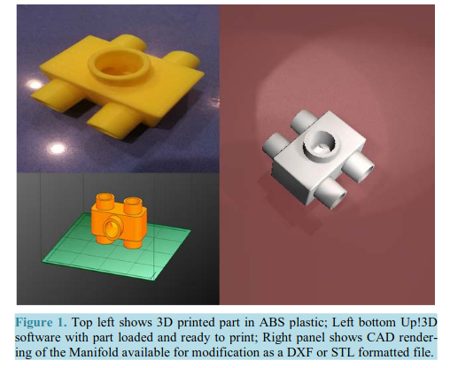
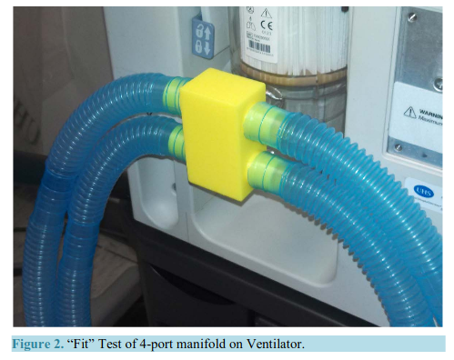

# Verbrauchsteile

## Ventil für Beatmungsgeräte

* [https://www.deutschlandfunk.de/kreative-loesungen-in-zeiten-von-corona-lebensretter-aus.676.de.html?dram:article\_id=472978](https://www.deutschlandfunk.de/kreative-loesungen-in-zeiten-von-corona-lebensretter-aus.676.de.html?dram:article_id=472978)
  * Firma Issinova in Brescia, 
  * [https://www.canplastics.com/3d-printing/italian-startup-3d-prints-medical-valves-to-help-covid-19-patients/1003452474/](https://www.canplastics.com/3d-printing/italian-startup-3d-prints-medical-valves-to-help-covid-19-patients/1003452474/)
* Valve for Masks [https://twitter.com/foosel/status/1239959577803841538](https://twitter.com/foosel/status/1239959577803841538)
* [https://www.offene-werkstaetten.org/post/covid-19-das-koennen-offene-werkstaetten-tun](https://www.offene-werkstaetten.org/post/covid-19-das-koennen-offene-werkstaetten-tun) 

### Ventilator Valves

* 3D Printing Ventilator Valves for Coronavirus AND How YOU Can Help!
  * [https://www.youtube.com/watch?v=1v5A9f2WwZc&amp=&feature=youtu.be](https://www.youtube.com/watch?v=1v5A9f2WwZc&amp=&feature=youtu.be)

* [https://www.3dnatives.com/de/3d-druck-rettet-leben-in-italien-covid-19/](https://www.3dnatives.com/de/3d-druck-rettet-leben-in-italien-covid-19/)
* "_Es ist uns gelungen, Cristian Fracassi, der die STL-Datei erstellt hat, zu kontaktieren, um das Modell zu erhalten und es mit Ihnen zu teilen. Leider erklärte er uns: „Ich kann die Datei nicht teilen, da im Moment nur 150 Teile benötigt werden. Wenn ein Krankenhaus mir den korrekten Namen für die Ventile gibt und es seinen Lieferanten kontaktiert hat, der ihm mitteilt, dass es nicht rechtzeitig liefern kann, werde ich ihm die Akte zusenden. Der Premierminister rief mich persönlich an und bat mich, nichts weiterzugeben_. » ....
* [https://futurezone.at/produkte/3d-drucker-rettet-corona-patienten-in-italien-das-leben/400783262](https://futurezone.at/produkte/3d-drucker-rettet-corona-patienten-in-italien-das-leben/400783262)

### Ein Gerät für mehrere Masken

* Experimental 3D Printed 4-Port Ventilator Manifold for Potential Use in Disaster Surges
  * [https://m.scirp.org/papers/49209](https://m.scirp.org/papers/49209)

