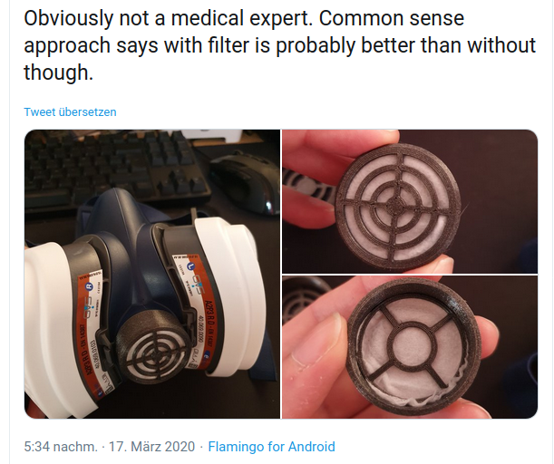

# Openmask

## Openmask

* [https://www.opensourcemask.com/en/](https://www.opensourcemask.com/en/)
* [https://www.kompetenzzentrum-ilmenau.digital/news/item/304-dringende-suche-nach-3d-druck-kapazitaeten](https://www.kompetenzzentrum-ilmenau.digital/news/item/304-dringende-suche-nach-3d-druck-kapazitaeten)
  * Anschreiben am 21.03.20

wo kann man Masken in US Krankenhäusern abliefern

* [https://www.covid19maskmatch.org/](https://www.covid19maskmatch.org/)

### Umbau von Masken

* [https://twitter.com/foosel/status/1239953372016513024](https://twitter.com/foosel/status/1239953372016513024)

### Normen

* fft2 und fft3

