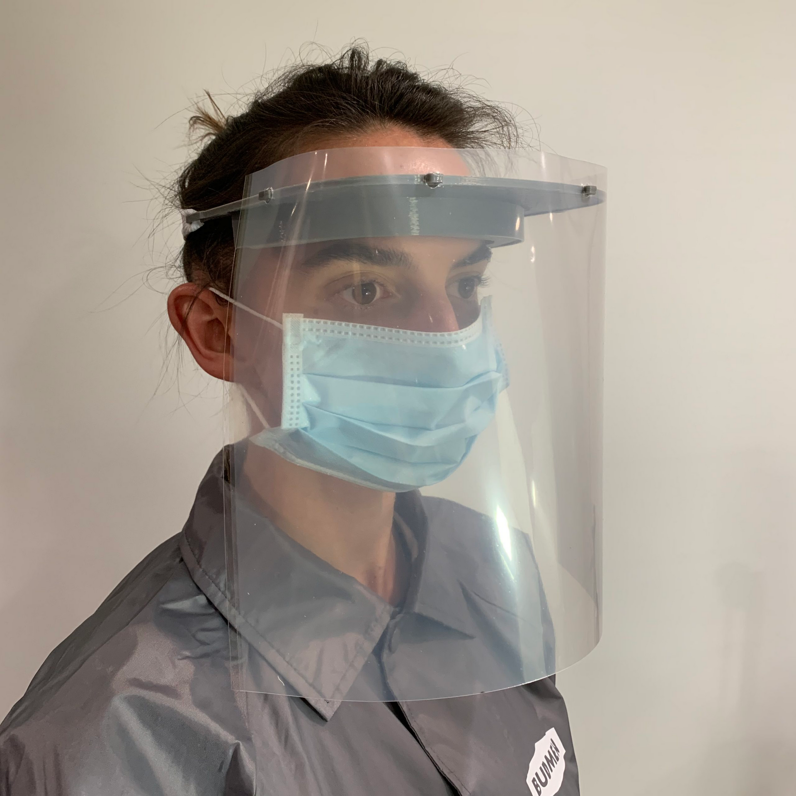

# Prusa Gesichtsschild

## Prusa Faceshield

* [https://blog.prusaprinters.org/from-design-to-mass-3d-printing-of-medical-shields-in-three-days/](https://blog.prusaprinters.org/from-design-to-mass-3d-printing-of-medical-shields-in-three-days/)
* [Openmask](:/bad4ec54c3714110aa86b8a8553824b6)

### Quelle

* [https://www.prusaprinters.org/prints/25857-prusa-protective-face-shield-rc2](https://www.prusaprinters.org/prints/25857-prusa-protective-face-shield-rc2)
* [https://blog.prusaprinters.org/from-design-to-mass-3d-printing-of-medical-shields-in-three-days/](https://blog.prusaprinters.org/from-design-to-mass-3d-printing-of-medical-shields-in-three-days/)
* [https://www.prusaprinters.org/prints/25857-protective-face-shield-rc1/files](https://www.prusaprinters.org/prints/25857-protective-face-shield-rc1/files)
* [http://daniepstein.com/daniepstein/3d-printable-face-shield/](http://daniepstein.com/daniepstein/3d-printable-face-shield/)
* This 3D Printed visor i designed, optimized for fast FDM-printing with large \(&gt;.8\) nozzles
  * [https://twitter.com/erikcederb/status/1240960467834634240](https://twitter.com/erikcederb/status/1240960467834634240)
  * [https://en.wikipedia.org/wiki/Hole\_punch\#Sweden](https://en.wikipedia.org/wiki/Hole_punch#Sweden) \(Anordnung der Löcher wie beim 4 fach Locher\)

### Budmen

* [https://budmen.com/](https://budmen.com/)

### aus dem Slack Channel

* [https://prusafaceshields.slack.com/archives/C010H2VVA85/p1584828613014600](https://prusafaceshields.slack.com/archives/C010H2VVA85/p1584828613014600)

